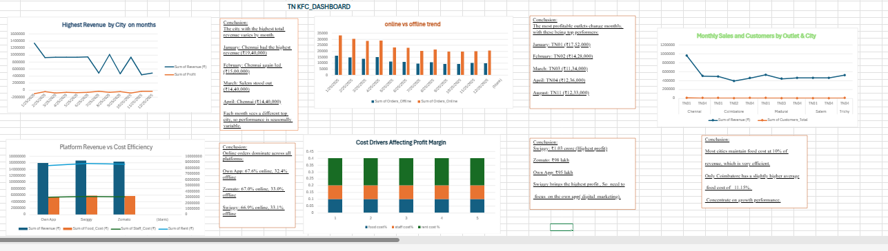

 📊 KFC Sales Dashboard

An interactive Excel-based dashboard analyzing KFC outlet sales performance across Tamil Nadu. It leverages **DAX formulas** for KPI calculations and visual storytelling using pivot charts and slicers.

 🎯 Project Objective

To uncover performance patterns across cities and platforms, evaluate cost efficiency, and support strategic decisions for outlet operations and marketing.

 ✨ Features

* Monthly revenue and profit by city
* Platform-wise cost efficiency analysis
* Online vs offline order trends
* Profit margin cost driver breakdown
* Interactive slicers for dynamic filtering

 🧰 Tools Used

* Microsoft Excel
* DAX (Data Analysis Expressions)
* Pivot Charts
* Slicers

📂 Dataset Summary

Contains monthly transactional records of KFC outlets across 6 cities, with fields like:
`Orders_Online`, `Revenue`, `Costs`, `Customers`, and `Platform`.

 📊 Dashboard Preview

* KPIs
* Pivot charts
* Interactive filtering

 🔍 Key Insights

* Chennai outlets consistently generate the highest revenue.
* Swiggy has the best cost-to-profit efficiency.
* Most outlets maintain food cost ≈ 10% of revenue.
* Seasonal trends impact online/offline orders.

 ▶️ How to Use

1. Open the Excel file.
2. Use slicers to filter by platform, city, or month.
3. Hover over charts to view exact figures.
4. Analyze KPIs and summaries to draw conclusions.

🚀 Future Enhancements

* Automate dataset refresh via Power Query.
* Integrate VBA for email reporting.
* Add forecasting using Excel trendlines.

 📬 Contact

MANJULA SIVASAMY

📧 [manjulasivasamy02@gmail.com](mailto:manjulasivasamy02@gmail.com)

💼 [LinkedIn](https://www.linkedin.com/in/manjula-sivasamy-dataanalyst)

🌐 [GitHub](https://github.com/ManjulaSivasamy-DataAnalyst)

